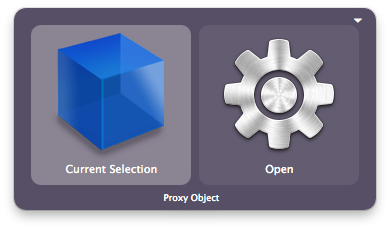
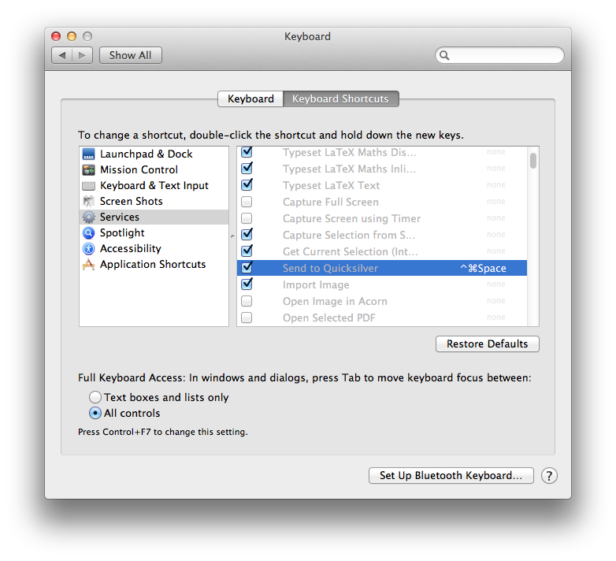

A useful shortcut/trigger for working with active files in Quicksilver
is the "Current Selection" trigger that opens the Quicksilver command
window with the files currently selected in Finder.app.

Unfortunately, Apple's implementation for this has broken in recent
versions of OSX, but there are two workarounds until Apple fix the
problem (unlikely ever to happen).

Also see [Grab 'n Drop](Grab_'n_Drop "wikilink").

__TOC__

## Proxy Object

There are two [proxy objects](Proxy_Object "wikilink") that can grab the
current Finder selection: "Finder Selection" and "Current Selection".

"Current Selection" also works on other kinds of selections, like a URL
highlighted in a text editor. Thus, you'll probably want to use "Current
Selection" unless you're either making a trigger that should only work
on a file/folder, or need to get the Finder Selection while another
program is in focus.

Beta 72 now includes a default trigger for this, called "Command Window
with Selection". (Under Quicksilver preferences \> Triggers \>
Quicksilver, called "Command Window with Selection".)

## Send to Quicksilver (Service)

[Services](http://www.macworld.com/article/1163996/how_to_use_services_in_mac_os_x.html)
can be a bit tricky. Any OSX application can register a "service" which
is available from the application menu under "Services". You can assign
shortcuts to them and use them much like you would use a Quicksilver
trigger. Aside: Quicksilver can use services from other applications
using the [Service Menu Module](Service_Menu_Module "wikilink").

Quicksilver has a built in service called "Send to Quicksilver",
functioning similarly to the "Current Selection" proxy object.

This service has the keyboard shortcut ⌘⎋, which is the same as the
"Command Window with Selection" trigger built into Quicksilver. If you
wish to use the service separately from the "Command Window with
Selection" trigger, then you should change the keyboard shortcut for the
trigger in the Trigger preferences.

## Tradeoffs

In short:

-   The proxy object suffers from [a serious, well-known bug in recent
    versions of OSX](http://openradar.appspot.com/9406282). Sometimes it
    returns the wrong object, usually the previous Finder selection from
    a different window. (Imagine what could happen if you create a
    trigger for an irreversible action like "Delete (Erase)".) There is
    no good known workaround, so if you'd like this to be fixed, please
    create one more bug report to tell Apple to fix this:
    [1](https://bugreport.apple.com/)
-   "Send to Quicksilver (Service)" cannot be used to make triggers, and
    doesn't work on the current Finder window if there's nothing
    selected.

| Behaviour                                                                                                    | Proxy Object                   | Send to Quicksilver |
|--------------------------------------------------------------------------------------------------------------|--------------------------------|---------------------|
| Always returns the correct selection from Finder.                                                            | ✗                              | √                   |
| Works in Finder with a file/folder selected                                                                  | √                              | √                   |
| Works in Finder if there is no file/folder selected (returns current window's folder)                        | √                              | ✗                   |
| Works in Finder with column mode                                                                             | √                              | ✗                   |
| Works on selections in other programs                                                                        | √ (Use "Current Selection")    | √                   |
| Can be used with triggers                                                                                    | √                              | ✗                   |
| Does \*not\* have a tiny proxy resolution delay (used to be 0.5s, soon to be 0.1s)                           | ✗                              | √                   |
| Is \*not\* cached for 3.0s (where using a cached proxy object again within 3.0s will not refresh the object) | ✗ (same for all proxy objects) | √                   |
| Does \*not\* change application focus to Quicksilver.app (only relevant if Quicksilver is in the Dock)       | √                              | ✗                   |

(Note: This table is organized so that all "good" behaviour is "√" and
all "bad" behvaiour is "✗".)

## Links

Main GitHub Issues:

-   [\#510 - Finder selection shortcut (Cmd-G) doesn't
    work](https://github.com/quicksilver/Quicksilver/issues/510)
-   [\#485 - Issues with Finder Selection (Proxies and
    Service)](https://github.com/quicksilver/Quicksilver/issues/485)
-   [\#1295 - Reshuffle of services and add trigger for ⌘⎋. Fixes
    \#409](https://github.com/quicksilver/Quicksilver/pull/1295#issuecomment-11463027)
-   [\#409 - Two separate services (one internal and one not) can be
    confusing](https://github.com/quicksilver/Quicksilver/issues/409)