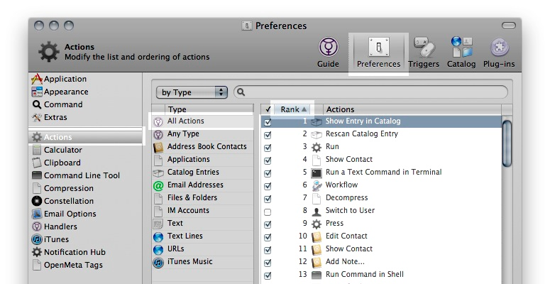

<b>Based on original text and images from [Howard Melman's User
Manual](http://groups.google.com/group/blacktree-quicksilver/web/Quicksilver.pdf?_done=%2Fgroup%2Fblacktree-quicksilver%3F)</b>

<b>Explanation</b>

When selecting an object in Quicksilver's first pane, an action will
appear in the second pane based on that object. The ranking of actions
in 'Preferences - Actions' determines which action that will be, and
also the subsequent list of actions in the second pane's results list.
To change the order of actions, select 'Rank' and drag and drop actions
to the desired place.

This is only part of the story however, as actions are also grouped by
object type.

