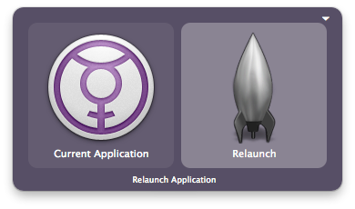
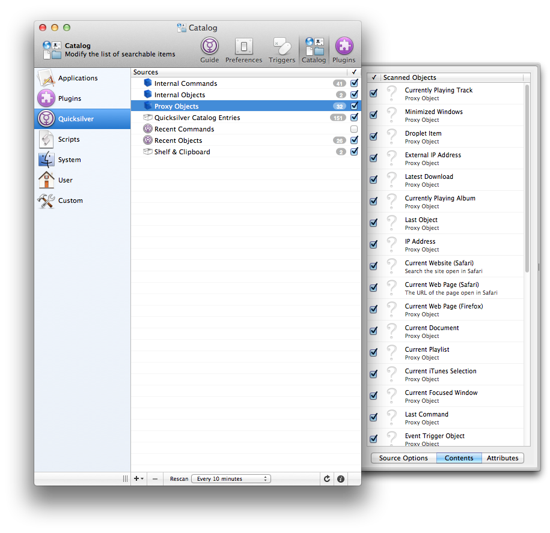

A proxy object is a Quicksilver object that is resolved dynamically,
based on the current state of your computer. This is very useful if you
want to create a trigger that applies to a current file/song/URL/the
latest download/etc.

For example, a useful trigger might be "Current Application \> Relaunch"

Proxy objects can be added by plugins. For example, the [Safari
plugin](Safari_Module "wikilink")'s "Current Web Page" proxy object will
refer to the current page you have open

You can view your available proxy objects under Quicksilver's
preferences \> Catalog \> Quicksilver.
