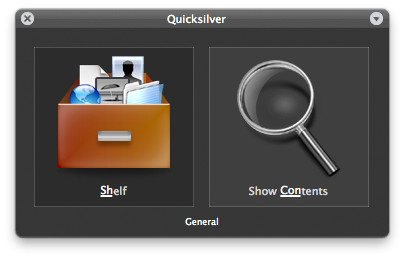
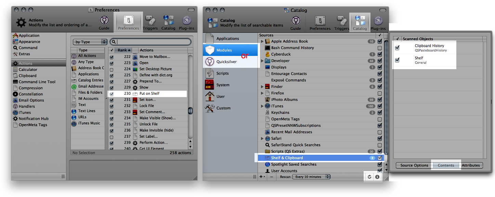
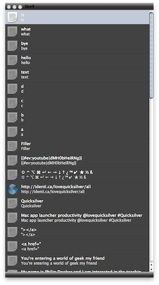

An excellent in-depth guide can be found in [Howard Melman's User
Manual](http://groups.google.com/group/blacktree-quicksilver/web/Quicksilver.pdf?_done=%2Fgroup%2Fblacktree-quicksilver%3F)
on p105.

The Shelf Module is great for saving chunks of text or files for later
use. It could be used for form replies, passwords (unsecure), code
snippets, URLs, addresses, lorem ipsum, etc. On the video, a bunch of
special characters can be seen on the Shelf. Select that line using the
'Shelf \> Show Contents' trigger, press '.' and select and copy the
character needed. With the Shelf open, text and items can also be
dragged to and from the Shelf. You can also select an item within the
Shelf window, and press delete to remove it.

Don't store too many high memory files such as images, as this can cause
Quicksilver to hang. If you have this problem, quit Quicksilver, delete
\~/Library/Application Support/Quicksilver/Shelves and relaunch (\~ is
the Home folder). <b>Caution</b>: the Shelf and Clipboard will be reset
to empty, and the Catalog entry might need to be rechecked and
rescanned.

Setup and usage video. There's also a 'Show' action in Preferences \>
Actions. Keyboard presses shown. (The ⌘V presses when pasting from the
Shelf are Quicksilver telling System Events to use that keystroke.)
{{#ev:youtube\|7f5stuN5Ag8}}

Install the Shelf Module in Preferences \> Plug-ins.

<b>Commands</b>

<table>
<thead>
<tr class="header">
<th>
Pane 1
</th>
<th>
Pane 2
</th>
<th>
Pane 3
</th>
<th>
Extra Requirements
</th>
<th>
Notes
</th>
</tr>
</thead>
<tbody>
<tr class="odd">
<td>
Shelf
</td>
<td>
Show Contents
</td>
<td></td>
<td></td>
<td></td>
</tr>
<tr class="even">
<td>
Shelf item (→ into Shelf)
</td>
<td>
Remove from Shelf
</td>
<td></td>
<td></td>
<td>
A good way to use this is to assign the command to a trigger, and
in Preferences &gt; Actions, have 'Paste with Clipboard' as text's first
action.
</td>
</tr>
<tr class="odd">
<td>
Object (Text/File/URL/Other)
</td>
<td>
Put on Shelf
</td>
<td></td>
<td></td>
<td></td>
</tr>
<tr class="even">
<td>
Shelf
</td>
<td>
Show
</td>
<td></td>
<td></td>
<td>
To emulate the video, assign this to a trigger, and drag the
window into the side of the screen to anchor it. 

</td>
</tr>
<tr class="odd">
<td></td>
<td></td>
<td></td>
<td></td>
<td></td>
</tr>
</tbody>
</table>

